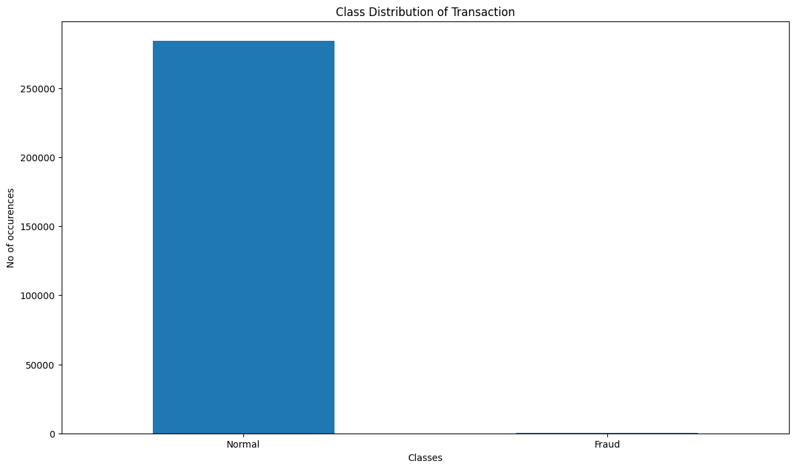
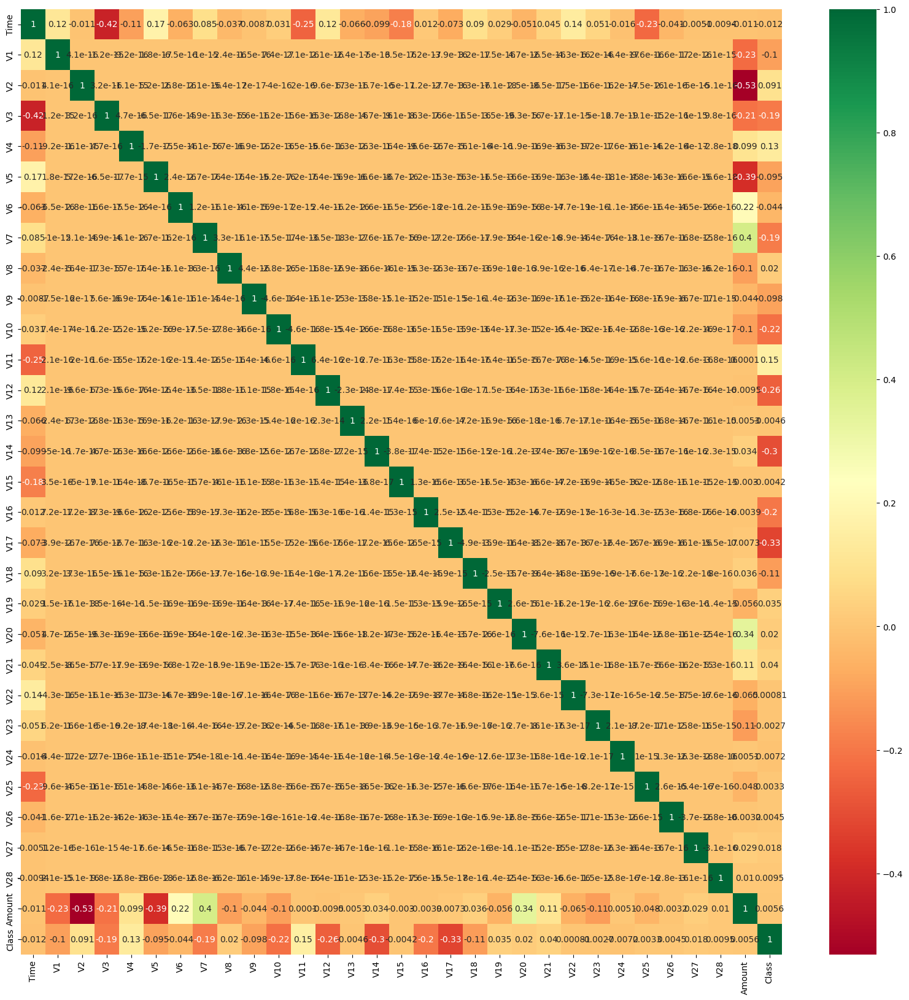

# Credit Card Fraud Detection Pipeline

An end-to-end machine learning pipeline built to detect fraudulent credit card transactions. This project evaluates multiple predictive models, handles extreme target class imbalances, and benchmarks overall performance metrics to ensure accurate detection rates.

## Project Overview
Financial fraud amounts to billions of dollars in losses annually. This repository demonstrates how to ingest, analyze, and scale a dataset containing real-world credit card transactions. Because fraud accounts for a tiny fraction of total transactions, the project focuses heavily on evaluating classification models beyond basic accuracy—specifically targeting precision, recall, and confusion matrix rates.

## Dataset Used
The pipeline utilizes the classic **Kaggle Credit Card Fraud Detection dataset** (`creditcard.csv`). 
* **Total Transactions:** 284,807 
* **Features:** 28 PCA-transformed numerical features ($V1$ through $V28$), transaction `Time`, and transaction `Amount`.
* **Target Feature:** `Class` (where `0` represents a normal transaction and `1` represents a fraudulent transaction).
* **Imbalance Profile:** Extremely skewed, with fraud instances making up roughly 0.173% of the data.

## Algorithms Implemented
The project trains and evaluates two distinct classification architectures to benchmark speed against prediction sensitivity:
1. **Decision Tree Classifier:** Configured with an entropy split criterion to capture non-linear transaction relationships quickly.
2. **Support Vector Classifier (SVC):** Trained using a Radial Basis Function (RBF) kernel to map multidimensional boundaries in scaled feature space.

## Technologies
* **Language:** Python 3.10+
* **Core Framework:** Scikit-Learn
* **Data Processing:** Pandas, NumPy, SciPy
* **Data Visualization:** Matplotlib, Seaborn

---

## Data Visualizations

### 1. Target Class Imbalance
The bar chart below highlights the stark difference in volume between legitimate actions and anomalous fraud events.



### 2. Feature Interactions
A complete correlation matrix heatmap checks for hidden colinear connections or unique relationships between hidden variables and transaction volumes.



---

## Results & Model Comparison

Both architectures achieve high standard accuracy scores due to the dataset's high baseline imbalances, but they reveal different trade-offs under careful matrix breakdown:

### Decision Tree Metrics
* **Accuracy:** ~99.92%
* **Precision (True Fake Rate):** High precision filters out false positives, ensuring valid customers aren't blocked needlessly.
* **Recall (Sensitivity):** Flags the true percentage of actual fraud caught by the decision framework.

### Support Vector Machine (SVC) Metrics
* **Accuracy:** ~99.93%
* **Boundary Alignment:** Outperforms basic rule-based trees on edge-case exceptions but demands higher computational overhead to scale.

---

## Getting Started

1. Clone this repository:
   ```bash
   git clone [https://github.com/YOUR_USERNAME/YOUR_REPOSITORY_NAME.git](https://github.com/YOUR_USERNAME/YOUR_REPOSITORY_NAME.git)
   cd YOUR_REPOSITORY_NAME
